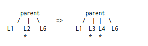
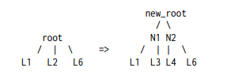
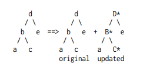

# Designing a Database
### 2. Types of Queries

Most SQL queries can be broken down into 3 types:
1. Scan the whole data set
2. Point query: Query the index by a specific key
3. Range query: Query the index by a range. (The index is sorted)

Scanning however is a O(N) no matter how fast it is. Thus, we implement our queries that can be served in O(log N) using data structures.

A range query consists of:
1. Seek: find the starting key
2. Iterate: find the previous/next key in sorted order.

A point query is just seek without iterate; a sorting data structure is all we need.

A B-tree is a balanced n-ary tree, comparable to balanced binary trees. Each node stores variable number of keys (and branches) up to $n$ and $n > 2$ 

### The B+Tree Variant
In the context of databases, B-tree means a variant of B-tree called B+tree. In a B+tree, internal nodes do not store values values only exist in the leaves. This leads to shorter trees because internal nodes have more space for branches.

### Maintaining a B+Tree
3 invariants to preserve when updating a B+Tree
1. Same height for all leaf nodes
2. Node size is bounded by a constant
3. Node is not empty

When inserting a leaf node, the 2nd invariant is violated. Thus, we split the node into smaller ones.

This could also lead to the parent node also splitting, which violates the size limit. Thus, we must propagate our splitting to the root node. This can increase the tree height.

Deleiting may result in empty nodes. Thus, we adhere to the third invariant by merging empty nodes into a "sibling" node. This could also lead to the propagation to the root node, so the tree height could decrease.

We use a copy-on-write data structure, for insertion or deletion. An example of this is illustrated below:

Here, the leaf c is updated. The copied on nodes are in uppercase, while the shared subtrees are in lower case.

### What is the Range Query?
A common database operation that retrieves all records where some value is between an upper and lower boundary.

### What is the Point Query?
Lookup based on a single value. Example in SQL `SELECT * FROM person WHERE birthyear=1975!`

